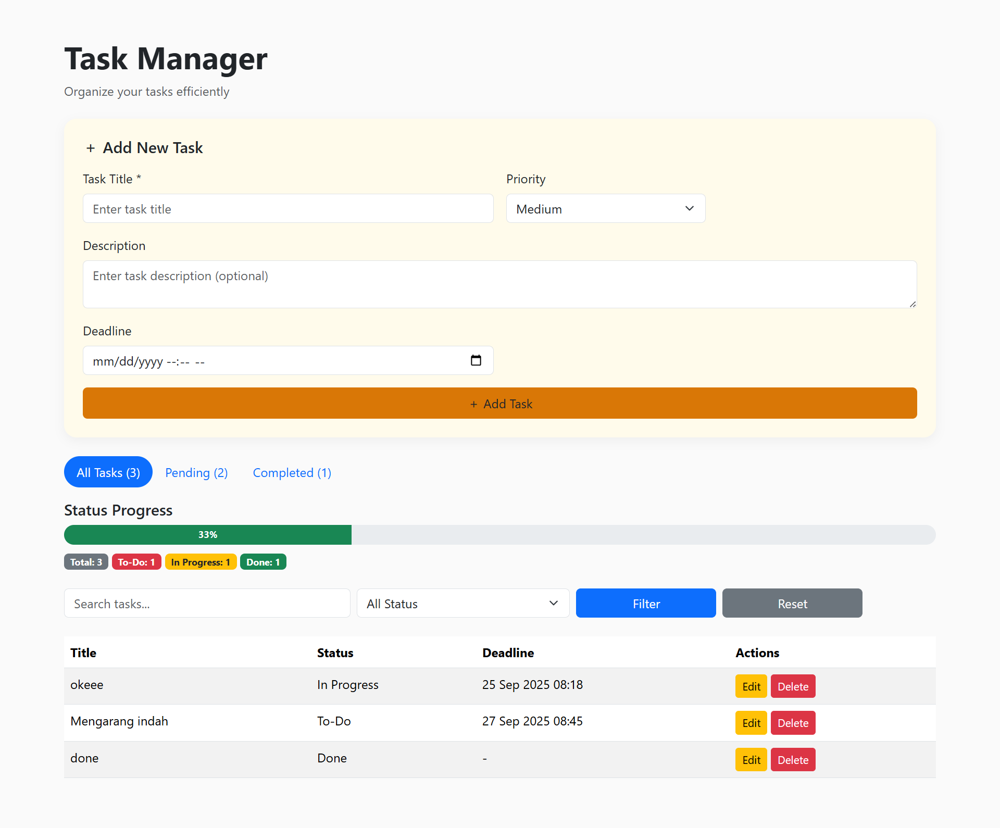

# Task Manager - Laravel To-Do List

A simple **Task Manager Web App** built with **Laravel, MySQL/SQLite, and Bootstrap**.  
This project allows users to **create, read, update, delete (CRUD)** tasks with search, filter, and progress tracking.

---

## Features
- Add new tasks (title, description, status, priority, deadline)  
- View all tasks with pagination  
- Search & filter tasks by keyword or status  
- Edit existing tasks  
- Delete tasks  
- Progress bar showing completion percentage  
- Clean & responsive UI with Bootstrap  

---


## 📸 Screenshot


---


## Installation (Local)

### 1. Clone the repository
```bash
git clone https://github.com/your-username/task-manager.git
cd task-manager
```

### 2. Install dependencies
```bash
composer install
npm install && npm run build
```

### 3. Copy environment file
```bash
cp .env.example .env
```

### 4. Set up database
You can use **SQLite** (simplest) or MySQL.

#### SQLite
```bash
touch database/database.sqlite
```
Then edit `.env`:
```env
DB_CONNECTION=sqlite
DB_DATABASE=/database/database.sqlite
```

#### MySQL
```env
DB_CONNECTION=mysql
DB_HOST=127.0.0.1
DB_PORT=3306
DB_DATABASE=task_manager
DB_USERNAME=root
DB_PASSWORD=
```

### 5. Generate application key
```bash
php artisan key:generate
```

### 6. Run migrations
```bash
php artisan migrate
```

### 7. Start local server
```bash
php artisan serve
```

Now open your browser at [http://127.0.0.1:8000](http://127.0.0.1:8000) 

---

## 👨‍💻 Author
Ken Duigraha Putra